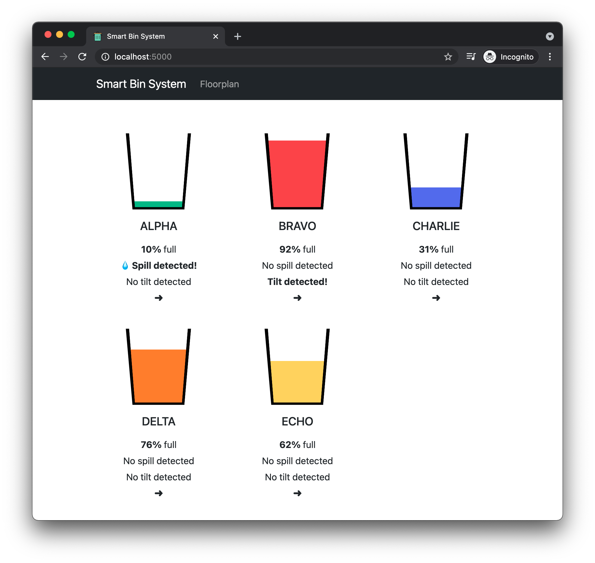
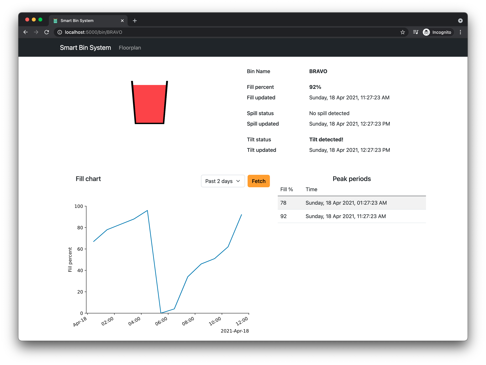
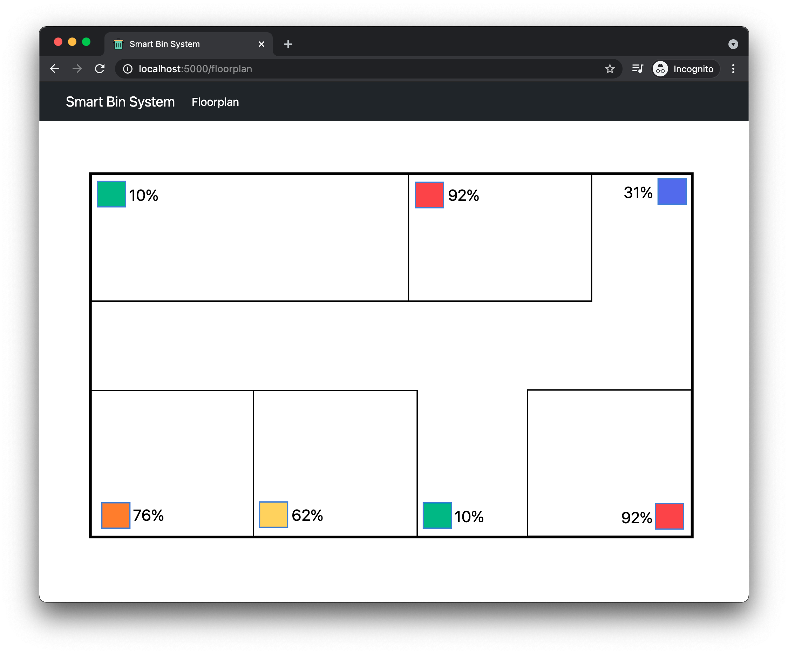

## Setup

Install Python 3

Setup virtualenv

```
pip3 install virtualenv
python3 -m virtualenv venv
source venv/bin/activate
```

Install required packages

```
pip3 install -r requirements.txt
```

**Run flask app**

```
# windows
set FLASK_ENV=development
set FLASK_APP=flask_app
OR
# unix
export FLASK_ENV=development
export FLASK_APP=flask_app

# initialise db
# create instance folder to store sqlite db
mkdir instance
python3 -m flask init-db

python3 -m flask run
```
**Run MQTT**

```
# Open another Terminal / Cmd
python3 MQTT-cloud.py
```

## Structure

Repo to store all functionality related to web platform, including flask server, and serial communication between microbit and RPi

### flask_app

`views.py`

Plan is to use this for template views

`api.py`

Plan is to use this for api endpoints, all routes prefixed with '/api'

See example SQL queries here

**Misc**

Bootstrap CSS library added with some custom overrides. Compiled from scss source files.

**examples**

`localhost:5000/` mockup for bin fill level


# API docs

### All fill level values

```http
GET /api/fill-level/all
```

**Response**

```javascript
[
  {
    "bin_name" : string,
    "fill_percent" : int,
    "time_updated" : string
  },
  ...
]
```

### Latest fill level for each bin

```http
GET /api/fill-level/latest
```

**Response**

```javascript
[
  {
    "bin_name" : string,
    "fill_percent" : int,
    "time_updated" : string
  },
  ...
]
```

### All fill level for specified bin

```http
GET /api/fill-level/name/<bin_name>
```

| Parameter  | Type     | Description            |
| :--------- | :------- | :--------------------- |
| `bin_name` | `string` | **Required**. Bin name |

**Response**

```javascript
[
  {
    "bin_name" : string,
    "fill_percent" : int,
    "time_updated" : string
  },
  ...
]
```

### Latest fill level for specified bin

```http
GET /api/fill-level/latest/<bin_name>
```

| Parameter  | Type     | Description            |
| :--------- | :------- | :--------------------- |
| `bin_name` | `string` | **Required**. Bin name |

**Response**

```javascript
{
  "bin_name": string,
  "fill_percent": int,
  "time_updated": string
}
```

### Update fill level

```http
POST /api/fill-level/update
```

**Body**

```javascript
{
  "bin_name": string,
  "distance": int
}
```

**Response**

```json
"Success"
```

### Update spill status

```http
POST /api/spill/update
```

**Body**

```javascript
{
  "bin_name": string,
  "spill_status": int
}
```

**Response**

```json
"Success"
```

### Update tilt status

```http
POST /api/tilt/update
```

**Body**

```javascript
{
  "bin_name": string,
  "tilt_status": int
}
```

**Response**

```json
"Success"
```

## Screenshots

### Overview


### Details


### Floorplan


