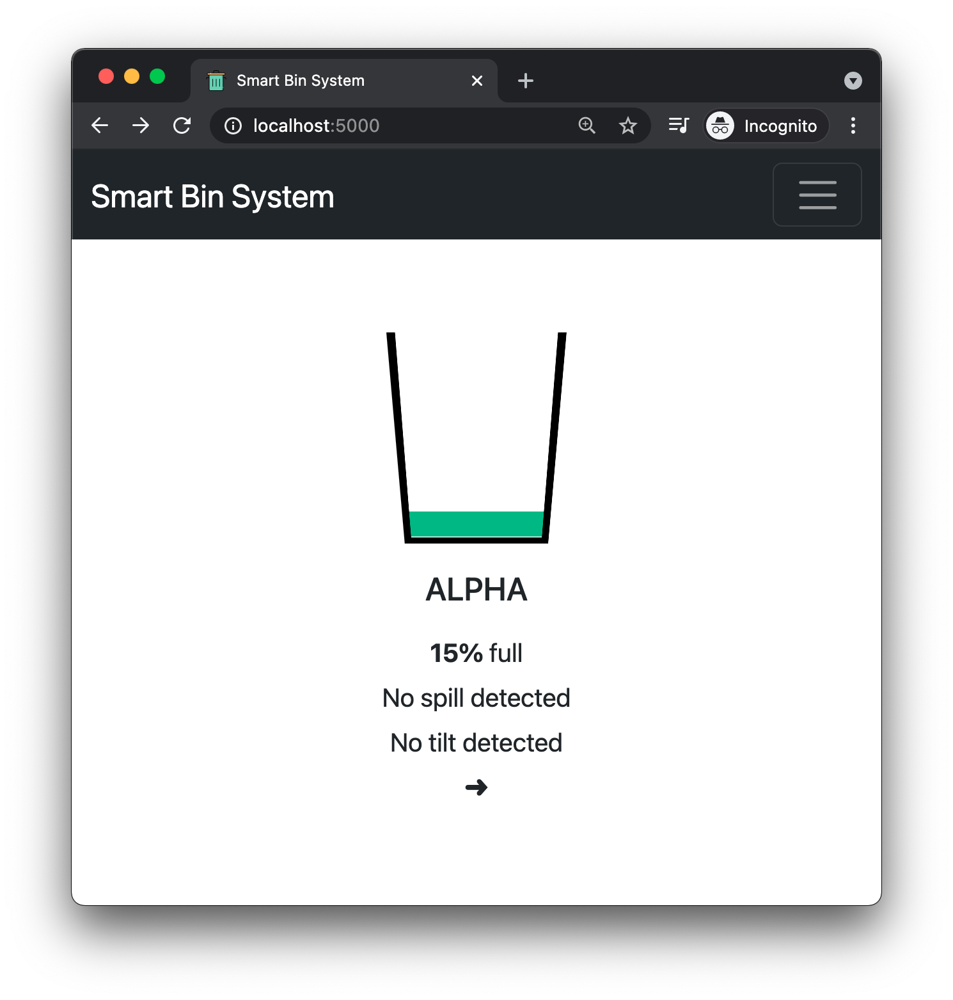
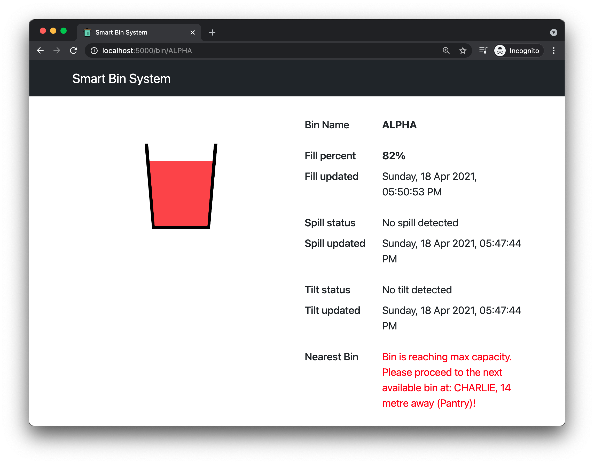

## Pre-setup: Waste Classifier

### Materials needed

3x LEDs
1x Button
4x Resistors
1x Breadboard

Setup above equipment according to pin layout in `rpi_waste_classifier.py`

Download model from http://comp.nus.edu.sg/~glenntan/IS4151-Model/model.zip

Unzip and rename folder to `model` and place in the same directory as `rpi_waste_classifier.py`

Requirements

```
pip3 install https://dl.google.com/coral/python/tflite_runtime-2.1.0.post1-cp37-cp37m-linux_armv7l.whl

pip3 install lobe
```

## Setup

Install Python 3

Setup virtualenv

```
pip3 install virtualenv
python3 -m virtualenv venv
source venv/bin/activate
```

Install required packages

```
pip3 install -r requirements.txt
```

**Run flask app**

```
# windows
set FLASK_ENV=development
set FLASK_APP=flask_app
OR
# unix
export FLASK_ENV=development
export FLASK_APP=flask_app

# initialise db
# create instance folder to store sqlite db
mkdir instance
python3 -m flask init-db

python3 -m flask run
```

**Run RPI's hub to receive information from all Microbits**

```
cd rpi_client
python3 hub.py
```

**Cloudrelay and MQTT setup**

MQTT Subscriber
```
# Open another Terminal / Cmd
# Ensure the handshake has been completed
python3 RPISubscriber.py
```

Cloudrelay
```
# Open another Terminal / Cmd on the same folder
cd ..
python3 cloudrelay.py
```
**

## Structure

Repo to store all functionality related to web platform, including flask server, and serial communication between microbit and RPi

### flask_app

`views.py`

Plan is to use this for template views

`api.py`

Plan is to use this for api endpoints, all routes prefixed with '/api'

See example SQL queries here

**Misc**

Bootstrap CSS library added with some custom overrides. Compiled from scss source files.

**examples**

`localhost:5000/` mockup for bin fill level


## Screenshots

### Overview



### Details




